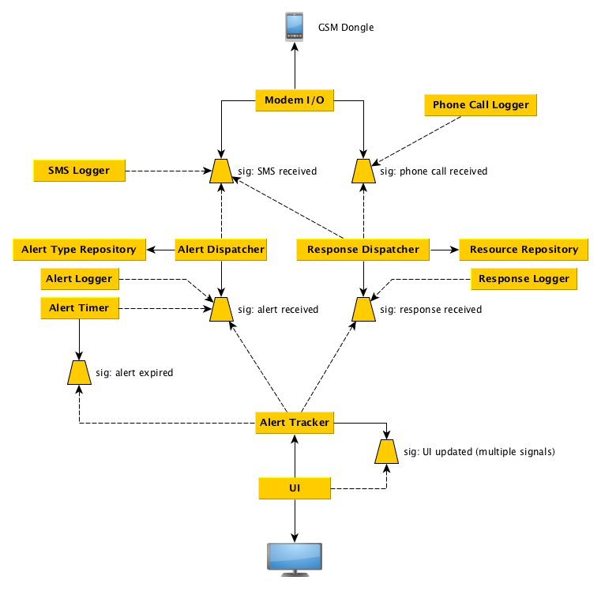

JumpSeat Technical Design
=========================

JumpSeat is an application that will:

- Receive alerts from the emergency dispatch center via SMS
- Show the details of the alert on the screen
- Receive status notifications from responding firefighters via SMS or phone call
- Show the response status on the screen
- Send SMS:s to predefined numbers in case an insufficient number of firefighters are responding

## Implementation Language and Runtime Environment

JumpSeat is designed to be deployed on a Raspberry Pi, connected to a wall mounted HD display
and a GSM dongle that supports AT commands. JumpSeat is implemented in C++ to keep it fast 
and responsive (and to teach yours truly how to write C++ programs).

## States

JumpSeat can run in two states:

- **standby**
  - the application is listening for SMS:s and phone calls
  - phone calls are logged and discarded
  - all SMS:s are logged, but only alert SMS:s are processed; the rest are discarded
  - the screen is showing the current date and time and a symbol indicating the status of the GSM connection
- **alerted**
  - the application is listening for SMS:s and phone calls
  - all SMS:s and phone calls are logged and processed
  - the screen is showing the alert details, the names of the firefighters that are responding and the time elapsed since the alert came in

## Modules

JumpSeat consists of several modules that mostly interact with each other through slots and signals:

### Modules

- **Modem I/O**: responsible for communicating with the GSM dongle
- **SMS Logger**: responsible for logging all incoming SMS:s in a log file
- **Phone Call Logger**: responsible for logging all incoming phone calls in a log file
- **Alert Type Repository**: contains a list of different alert type codes, their textual descriptions, colors used on the screen, etc
- **Alert Dispatcher**: responsible for detecting and parsing alert SMS:es
- **Alert Logger**: responsible for logging all incoming alerts in a log file
- **Alert Timer**: responsible for tracking the time elapsed after an alert was received.
- **Response Dispatcher**: responsible for detecting and parsing response SMS:ses and phone calls
- **Resource Repository**: contains a list of firefighters, their phone numbers and competences
- **Response Logger**: responsible for logging all incoming responses in a log file
- **Alert Tracker**: responsible for tracking an alert (basically merging alerts and responses together, making sure that enough resources are responding, etc.)
- **UI**: responsible for showing the state of the Alert Tracker on a screen

### Signals

- Backend signals
  - **SMS received** - when a new SMS comes in.
  - **phone call received** - when a phone call comes in.
  - **alert received** - when a new alert has been received from the emergency dispatch center. This forces the application to enter the **alerted** state.
  - **response received** - when a response has been received from a firefighter that has been alerted.
  - **alert expired** - when the alert has expired and the application can go back to the **standby** state.
- Frontend (UI) signals
  - To be defined